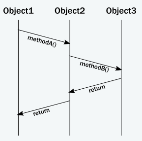

# Why modern system need a new programming model

사실 Actor 모델은 수십년전에 Carl Hewitt에 의해 제안되었다. Actor 모델은 고성능 병렬 네트워크 처리를 위한 방법으로 제시되었다.
하지만 당시에는 가능한 환경이 아니었고, 오늘날 하드웨어와 인프라스트럭처가 Hewitt의 비전을 실행할 수 있게 되었다.

Actor 모델만이 결론적으로 분산시스템을 구축하는데 효율적인 방법이라는 것은 아니지만, 많은 제품에서 그 효율성이 증명 되었다.

## The challenge of encapsulation

OOP의 핵심요소중 하나는 encapsulation이다. Encapsulation은 내부의 데이터를 외부에서 직접 접근하는 것을 지양한다.
객체는 캡슐화된 데이터를 비정상적인 변경으로부터 보호할 수 있는 안전한 메소드를 노출할 의무를 가지고 있다.

OOP의 런타임시 행동을 보면 아래와 같은 메소드 호출의 챠트로 메시지 전달을 표현할 수 있다.

